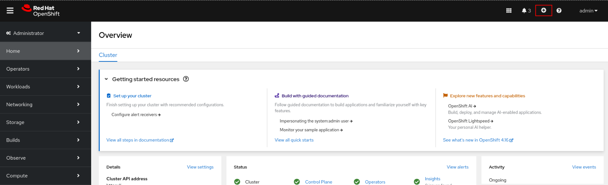
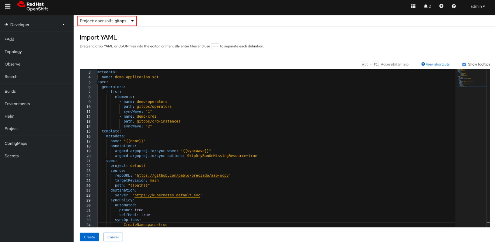
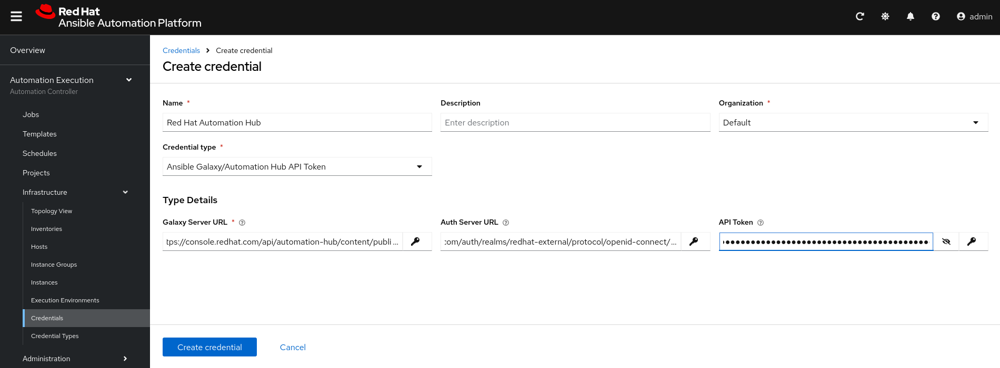
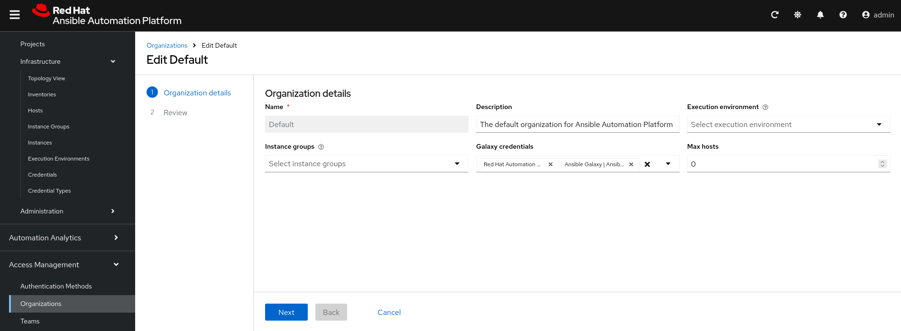
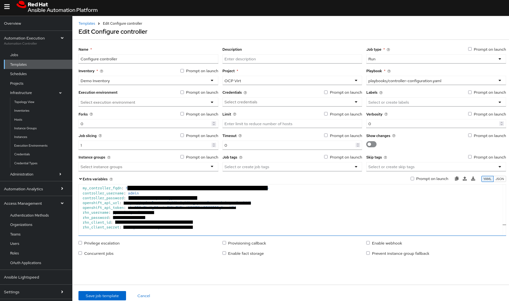
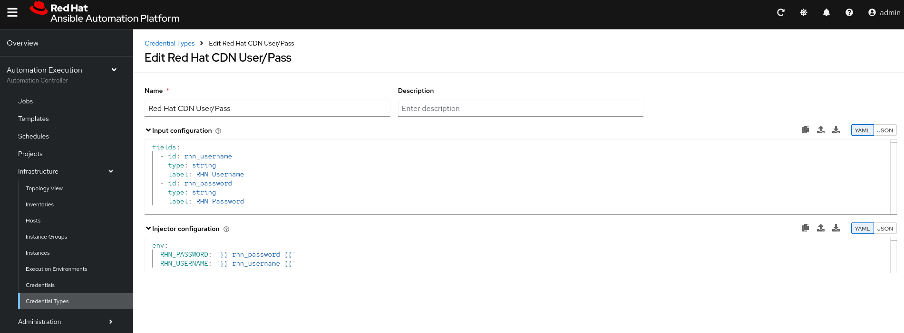
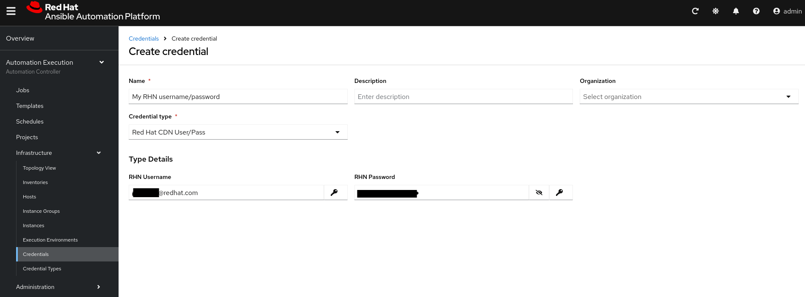
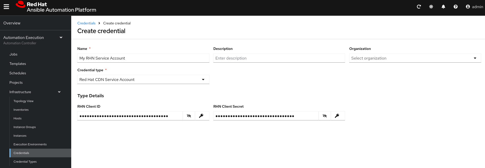

# Ansible and Openshift Virtualization demo

I'd like to use this space to mention that [this Red Hat article](https://www.redhat.com/en/blog/ansible-automation-platform-openshift-virtualization-multi-cluster-environment) was a source of inspiration for this repo. You can find detailed information about what's done in the article by looking at the [author's git repo](https://www.redhat.com/en/blog/ansible-automation-platform-openshift-virtualization-multi-cluster-environment)

## Resources needed to run this demo

You need an OpenShift cluster with OpenShift Virtualization capabilities. If you're a redhatter or a Red Hat partner you can request an OpenShift cluster running in GCP for the purposes of this demo, you can reuqeest it [here](https://catalog.demo.redhat.com/catalog?item=babylon-catalog-prod/gcp-gpte.ocp4-on-gcp.prod&utm_source=webapp&utm_medium=share-link).

## Prepare your cluster

Install OpenShift Gitops operator via Operator Hub. Use the default installation.

Once installed add the application set in this repo (/gitops/applications/demo-application-set.yaml). Click on the "+" sign on the top right of the GUI:



Then select the project openshift-gitops and copy paste the content of the file /gitops/applications/demo-application-set.yaml of this repo in the GUI:



This will install the OpenShift Virtualization and Ansible Automation Platform operators. It will also deploy our instance of Ansible Automation Platform in the namespace aap.

Wait until all CRD's are installed, then go to the aap namespace and search for the my-aap route and the secret my-aap-admin-password. You can obtain both values by running these commands:

```
oc get route my-aap -n aap -o jsonpath='{.spec.host}'
```
```
oc get secret my-aap-admin-password -n aap -o go-template --template="{{.data.password|base64decode}}"
```

In your browser navigate to the url of the my-aap route and login with user admin and the password you extracted from the secret.
On your first login you need to add your subscription, you can upload a manifest or use your Red Hat Network username and password. Add your subscription and accept the EULA:


Now go to Red Hat's Automation Hub and get a token so your Automation Controller can install official Red Hat collections. Login to [Ansible automation hub](https://console.redhat.com/ansible/automation-hub). Navigate to "Automation Hub" -> "Connect to Hub" and click "Load Token" under "Offline Token" to generate a token. Copy down the token, server URL, and SSO URL.

Now, in your Automation Controller, go to Automation Execution > Infrastructure > Credentials > Create Credential.

Fill the new credential with the following values:
 - Name: Red Hat Automation Hub
 - Organization: Default
 - Credential type: Ansible Galaxy/Automation Hub API Token
 - Galaxy Server URL: the Server URL you got from previour step
 - Auth server URL: the SSO URL you got from previour step
 - API Token: the one you got from previour step



Once you have created the credential go to Access Management > Organizations > Default > Edit organization. In the credentials section of the organization add the newly created organization, then uncheck and check again the "Ansible Galaxy" credentials (this is needed so the organization uses first the manually created credentials).

 

Create a project in Automation Execution > Projects > Create project with the following values:
 - Name: OCP Virt
 - Organization: Default
 - Source Control Type: Git
 - Source Control URL: https://github.com/pablo-preciado/aap-ocpv.git

 

Remember to sync the project before continuing.

Before configuring your job template you'll need to gather you OpenShift cluster API url and token, and you will also need to retrieve Red Hat Network client id and client secret.

To obtain OpenShift API url and token you can run these commands:
```
oc cluster-info
oc whoami --show-token
```
To obtain the data of your Service Account use a browser to navigate to [Red Hat Cloud Console](https://console.redhat.com/application-services/service-accounts). Click on Create service account and save your Client ID and Client Secret.

Now create the Job Template for configuring the Ansible Automation Controller. Go to Automation Execution > Templates > Create Template > Create Job Template. Fill with the following information:
 - Name: [CasC] Configure controller
 - Inventory: Demo Inventory
 - Project: OCP Virt
 - Playbook: playbooks/controller-configuration.yml
 - Extra variables: copy paste the following code but using the values you just retrieved.
```
my_controller_fqdn: your-aap-url.com
my_controller_user: admin
my_controller_pass: your-aap-password
openshift_api_url: your-ocp-api-url
openshift_api_token: your-ocp-api-token
rhn_username: your-red-hat-cdn-username
rhn_password: your-red-hat-cdn-password
rhn_client_id: your-red-hat-cdn-client-id
rhn_client_secret: your-red-hat-cdn-client-secret
```



Run the job template.
___________________________________________________________________________________

Install OpenShift Virtualization and Ansible Automation Platform operators.

Once both operators are installed deploy an instance of hyperconverge object and one AAP instance.

Create a new project to host our Ansible Automation Platform instance:

    oc new-project my-aap

Now create your AAP instance with the following definition as we don't want to use Automation Hub nor EDA Controller:

```
cat << EOF | oc apply -f -
apiVersion: aap.ansible.com/v1alpha1
kind: AnsibleAutomationPlatform
metadata:
  name: my-aap-instance
  namespace: my-aap
spec:
  route_tls_termination_mechanism: Edge
  no_log: true
  redis_mode: standalone
  api:
    log_level: INFO
    replicas: 1
  database:
    postgres_data_volume_init: false
  eda:
    disabled: true
  hub:
    disabled: true
```
Once it's deployed get the route to your AAP instance:

    oc get route my-aap-instance -n my-aap

Also get the admin password from the secret created by the operator:

    oc get secret my-aap-instance-admin-password -n my-aap -o go-template --template="{{.data.password|base64decode}}"

Login to the AAP instance with the admin user and the password you just retrieved. In AAP, fill the data so it can use a subscription:


In our case we use username/password with our Red Hat account, then accept EULA and finish.

You should now see something like this:


## Configure Automation Controller (credentials, organization and inventory)

Now go to Red Hat's Automation Hub and get a token so your Automation Controller can install official Red Hat collections. Login to [Ansible automation hub](https://console.redhat.com/ansible/automation-hub). Navigate to "Automation Hub" -> "Connect to Hub" and click "Load Token" under "Offline Token" to generate a token. Copy down the token, server URL, and SSO URL.

Now, in your Automation Controller, go to Automation Execution > Infrastructure > Credentials > Create Credential.

Fill the new credential with the following values:
 - Name: Red Hat Automation Hub
 - Organization: Default
 - Credential type: Ansible Galaxy/Automation Hub API Token
 - Galaxy Server URL: the Server URL you got from previour step
 - Auth server URL: the SSO URL you got from previour step
 - API Token: the one you got from previour step


Once you have created the credential go to Access Management > Organizations > Default > Edit organization. In the credentials section of the organization add the newly created organization, then uncheck and check again the "Ansible Galaxy" credentials (this is needed so the organization uses first the manually created credentials).

 

Create a project with the following values:
 - Name: OCP Virt
 - Organization: Default
 - Source Control Type: Git
 - Source Control URL: https://github.com/pablo-preciado/aap-ocpv.git

 

Lets create the credential for log into the ssh keys in our machines, in your Automation Controller, go to Automation Execution > Infrastructure > Credentials > Create Credential.

Fill the new credential with the following values:
 - Name: Linux user/pass
 - Organization: Default
 - Credential type: Machine
 - Username: redhat1
 - Password: redhat1

 

 Create credentials for the OpenShift cluster, go to Automation Execution > Infrastructure > Credentials > Create Credential.

 Fil the data for the new credential:
  - Name: OpenShift Cluster
  - Organization: Default
  - Credential type: OpenShift or Kubernetes API Bearer Token
  - OpenShift or Kubernetes API endpoint: paste the OpenShift cluster API endpoint, you can get it by running ```oc cluster-info```
  - API Authentication bearer token: paste the OpenShift cluster API token, you can get it by running ```oc whoami --show-token```


Create the Ansible inventory for your OpenShift Virtualization virtual machines, go to Automation Execution > Infrastructure > Inventories > Create inventory.

Fill the data with the following values:
 - Name: OCP Virt
 - Organization: Default


Now go to the inventory you just created click on the "Sources" tab and click on "Create source". Fill the data with the following values:
 - Name: OCP Virt
 - Source: OpenShift Virtualization
 - Credential: OpenShift Cluster


Once created, on the top right, click on "Launch inventory update".

We're going to create a couple of new Credential Types for connecting with Red Hat's CDN. go to Automation Execution > Infrastructure > Credential types > Create credential type. Give it the folowing values:
 - Name: Red Hat CDN User/Pass
 - Input configuration:
 ```
 fields:
  - id: rhn_username
    type: string
    label: "RHN Username"
  - id: rhn_password
    type: string
    label: "RHN Password"
    secret: true
```
 - Injector configuration:
 ```
 extra_vars:
  rhsm_username: "{{ rhn_username }}"
  rhsm_password: "{{ rhn_password }}"
 ```


Create another credential type for the Red Hat portal Service Account. Go to Automation Execution > Infrastructure > Credential types > Create credential type. Fill with the folowing values:
 - Name: Red Hat CDN Service Account
 - Input configuration:
 ```
 fields:
  - id: rhn_client_id
    type: string
    secret: true
    label: "RHN Client ID"
  - id: rhn_client_secret
    type: string
    label: "RHN Client Secret"
    secret: true
```
 - Injector configuration:
 ```
extra_vars:
  rhn_password: '{{ rhn_client_secret }}'
  rhn_username: '{{ rhn_client_id }}'
 ```


Now create Credentials for the newly created credential types. First go to Automation Execution > Infrastructure > Credentials > Create Credential. Use the following data:
 - Name: My RHN username/password
 - Credential type: Red Hat CDN User/Pass
 - RHN Username: your Red Hat Account username
 - RHN Password: your Red Hat Account password

 

Before proceeding to next step you need to obtain a Service Account Client ID and Client Secret from Red Hat portal. This is used by the jboss installer to download the necesary packages.
To obtain the data of your Service Account use a browser to navigate to [Red Hat Cloud Console](https://console.redhat.com/application-services/service-accounts). Click on Create service account and save your Client ID and Client Secret.

Then go to Automation Execution > Infrastructure > Credentials > Create Credential. Use the following data:
 - Name: My RHN Service Account
 - Credential type: Red Hat CDN Service Account
 - RHN Client: the Service Account Client ID you just retrieved from Red Hat Cloud Console
 - RHN RHN Client Secret: the Service Account Client Secret you just retrieved from Red Hat Cloud Console

 

## Configure Automation Job Templates for creating virtual machine, jboss installation and application deployment

First our Job Template for creating the necesary virtual machine in OpenShift Virtualization with its Service and Route. Go to Automation Execution > Templates > Create Template > Create Job Template. Fill with the following information:
 - Name: [JT] Create VM
 - Inventory: OCP Virt
 - Project: OCP Virt
 - Playbook: playbooks/create_vm.yml
 - Credentials: Openshift Cluster


Create next Job Template, this one will register our virtual machine operating system to Red Hat, add jboss 8 repos, install and start jboss server. Go to Automation Execution > Templates > Create Template > Create Job Template. Fill with the following information:
 - Name: [JT] Install and deploy Jboss EAP 8
 - Inventory: OCP Virt
 - Project: OCP Virt
 - Playbook: playbooks/install_jboss.yml
 - Credentials: Linux ssh user/pass, My RHN Service Account, My RHN Username/Password

 ¡¡¡¡ FOTO

Lastly, create the Job Template in charge of deploying a hello world aplication from the . Go to Automation Execution > Templates > Create Template > Create Job Template. Fill with the following information:
 - Name: [JT] Deploy hello world application
 - Inventory: OCP Virt
 - Project: OCP Virt
 - Playbook: playbooks/deploy_app.yml
 - Credentials: Linux ssh user/pass

¡¡¡¡ FOTO

## Configure a Workflow Template in Automation Controller

Workflow Templates are used for creating pipelines of Automation Jobs. In this case we're going to create a Workflow Template that runs the three Automation Jobs we created in previous step. Hence this Workflow Template will create our virtual machine, install jboss, start jboss and deploy our application. Everything in a single Job.

There's also one special job that we'll be adding to our Workflow Template. This is an inventory sync. This is needed after creating the virtual machine, thanks to it, Ansible Automation Controller will automatically add the newly created virtual machine to our inventory and next jobs can point to it to install Jboss and deploy our sample application.

Go to Automation Execution > Templates > Create Template > Create Workflow Template. Fill with the following information:
 - Name: [WF] Create VM and install jboss

¡¡¡¡ FOTO

Then, on the top right click on "View workflow visualizer". Add all the needed jobs until you have something similar to this:

¡¡¡¡ FOTO