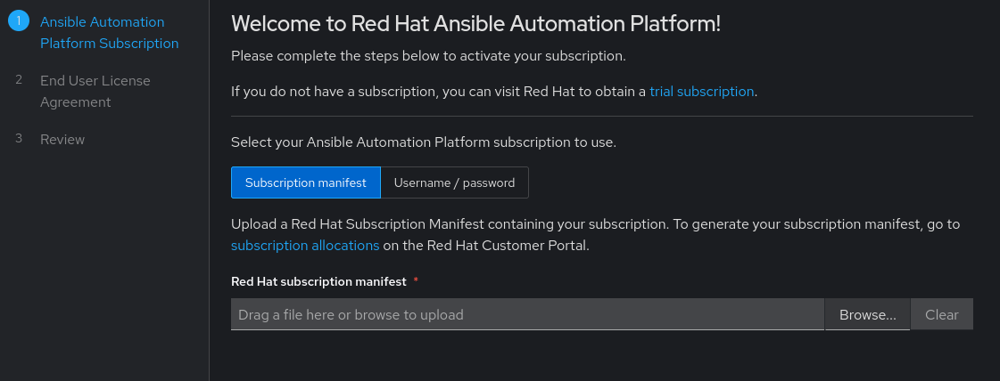
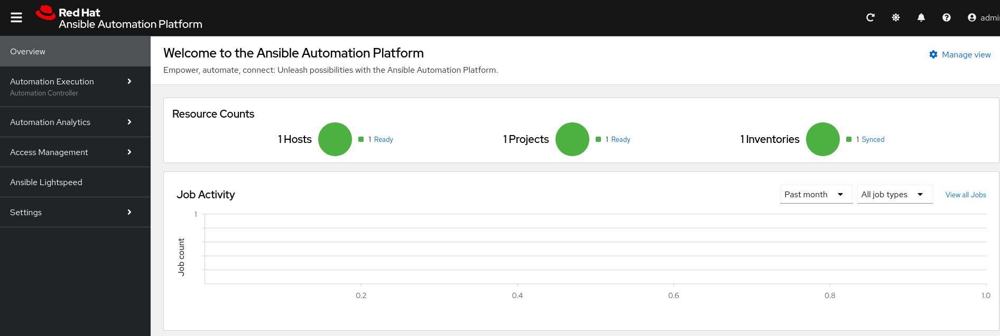
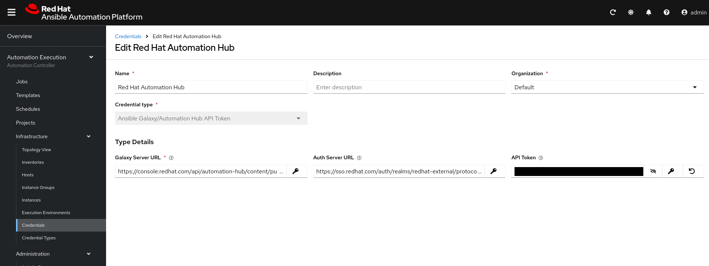
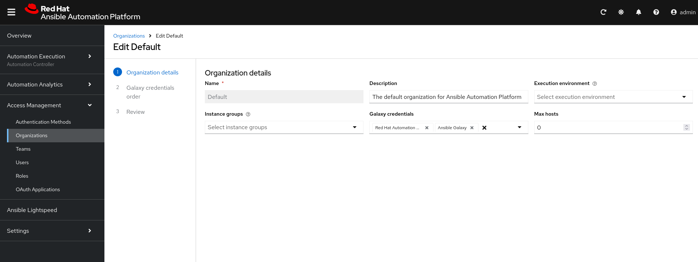
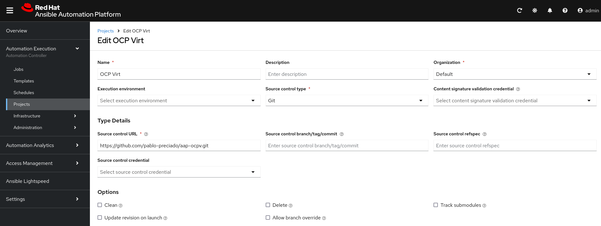
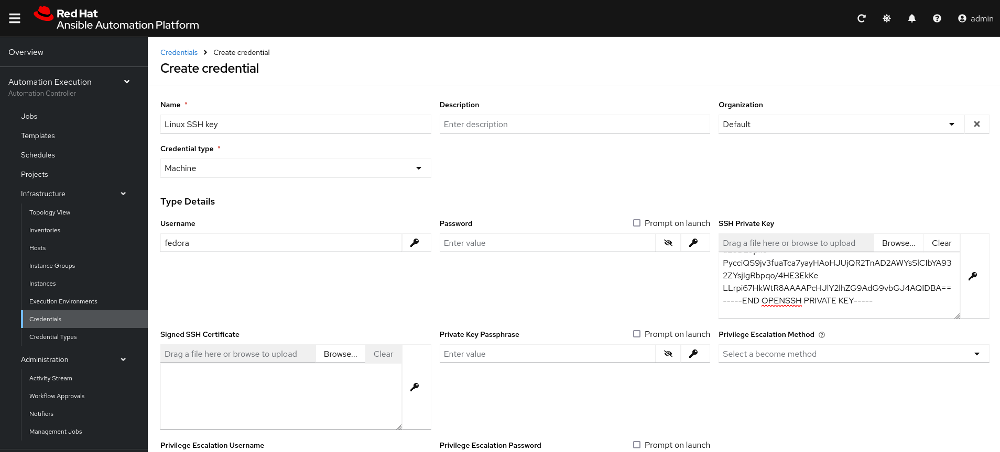
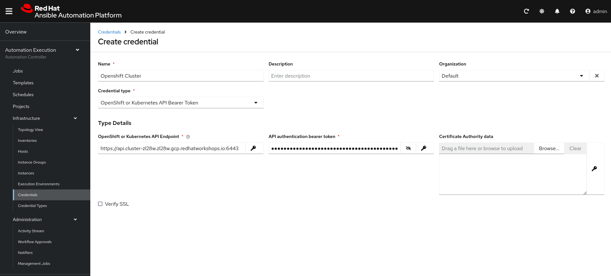
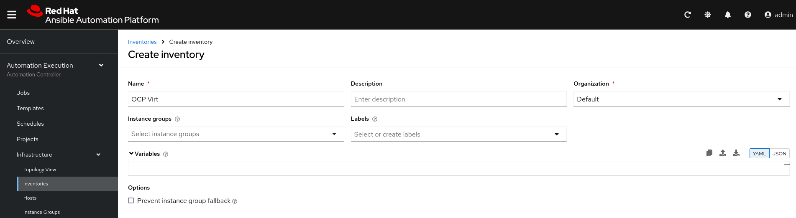
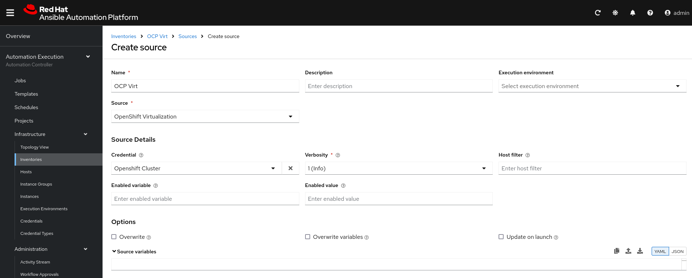
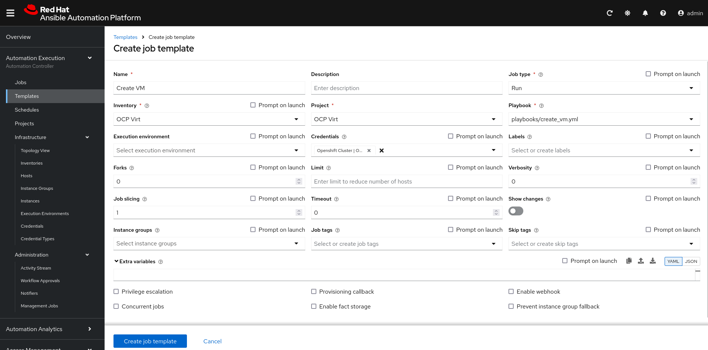

# Ansible and Openshift Virtualization demo

I'd like to use this space to mention that [this Red Hat article](https://www.redhat.com/en/blog/ansible-automation-platform-openshift-virtualization-multi-cluster-environment) was a source of inspiration for this repo. You can find detailed information about what's done in the article by looking at the [author's git repo](https://www.redhat.com/en/blog/ansible-automation-platform-openshift-virtualization-multi-cluster-environment)

## Resources needed to run this demo

You need an OpenShift cluster with OpenShift Virtualization capabilities. If you're a redhatter or a Red Hat partner you can request an OpenShift cluster running in GCP for the purposes of this demo, you can reuqeest it [here](https://catalog.demo.redhat.com/catalog?item=babylon-catalog-prod/gcp-gpte.ocp4-on-gcp.prod&utm_source=webapp&utm_medium=share-link).

## Prepare your cluster

Install OpenShift Virtualization and Ansible Automation Platform operators.

Once both operators are installed deploy an instance of hyperconverge object and one AAP instance.

Create a new project to host our Ansible Automation Platform instance:

    oc new-project my-aap

Now create your AAP instance with the following definition as we don't want to use Automation Hub nor EDA Controller:

```
cat << EOF | oc apply -f -
apiVersion: aap.ansible.com/v1alpha1
kind: AnsibleAutomationPlatform
metadata:
  name: my-aap-instance
  namespace: my-aap
spec:
  route_tls_termination_mechanism: Edge
  no_log: true
  redis_mode: standalone
  api:
    log_level: INFO
    replicas: 1
  database:
    postgres_data_volume_init: false
  eda:
    disabled: true
  hub:
    disabled: true
```
Once it's deployed get the route to your AAP instance:

    oc get route my-aap-instance -n my-aap

Also get the admin password from the secret created by the operator:

    oc get secret my-aap-instance-admin-password -n my-aap -o go-template --template="{{.data.password|base64decode}}"

Login to the AAP instance with the admin user and the password you just retrieved. In AAP, fill the data so it can use a subscription:



In our case we use username/password with our Red Hat account, then accept EULA and finish.

You should now see something like this:



## Configure Automation Controller (credentials, organization and inventory)

Now go to Red Hat's Automation Hub and get a token so your Automation Controller can install official Red Hat collections. Login to [Ansible automation hub](https://console.redhat.com/ansible/automation-hub). Navigate to "Automation Hub" -> "Connect to Hub" and click "Load Token" under "Offline Token" to generate a token. Copy down the token, server URL, and SSO URL.

Now, in your Automation Controller, go to Automation Execution > Infrastructure > Credentials > Create Credential.

Fill the new credential with the following values:
 - Name: Red Hat Automation Hub
 - Organization: Default
 - Credential type: Ansible Galaxy/Automation Hub API Token
 - Galaxy Server URL: the Server URL you got from previour step
 - Auth server URL: the SSO URL you got from previour step
 - API Token: the one you got from previour step



Once you have created the credential go to Access Management > Organizations > Default > Edit organization. In the credentials section of the organization add the newly created organization, then uncheck and check again the "Ansible Galaxy" credentials (this is needed so the organization uses first the manually created credentials).

 

Create a project with the following values:
 - Name: OCP Virt
 - Organization: Default
 - Source Control Type: Git
 - Source Control URL: https://github.com/pablo-preciado/aap-ocpv.git

 

Create ssh keys:

    ssh-keygen

Lets create the credential for log into the ssh keys in our machines, in your Automation Controller, go to Automation Execution > Infrastructure > Credentials > Create Credential.

Fill the new credential with the following values:
 - Name: Linux SSH key
 - Organization: Default
 - Credential type: Machine
 - Username: redhat1
 - Password: redhat1
 - SSH Private Key: the ssh key you created in previous step

 

 Create credentials for the OpenShift cluster, go to Automation Execution > Infrastructure > Credentials > Create Credential.

 Fil the data for the new credential:
  - Name: OpenShift Cluster
  - Organization: Default
  - Credential type: OpenShift or Kubernetes API Bearer Token
  - OpenShift or Kubernetes API endpoint: paste the OpenShift cluster API endpoint, you can get it by running ```oc cluster-info```
  - API Authentication bearer token: paste the OpenShift cluster API token, you can get it by running ```oc whoami --show-token```



Create the Ansible inventory for your OpenShift Virtualization virtual machines, go to Automation Execution > Infrastructure > Inventories > Create inventory.

Fill the data with the following values:
 - Name: OCP Virt
 - Organization: Default



Now go to the inventory you just created click on the "Sources" tab and click on "Create source". Fill the data with the following values:
 - Name: OCP Virt
 - Source: OpenShift Virtualization
 - Credential: OpenShift Cluster



Once created, on the top right, click on "Launch inventory update".

## Configure Automation Job Templates for creating virtual machine and day 2 operations

Go to Automation Execution > Templates > Create Template > Create Job Template. Fill with the following information:
 - Name: Create VM
 - Inventory: OCP Virt
 - Project: OCP Virt
 - Playbook: create_vm.yml
 - Credentials: Openshift Cluster

