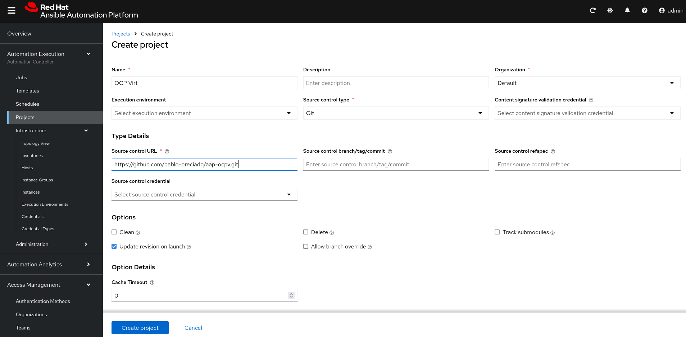
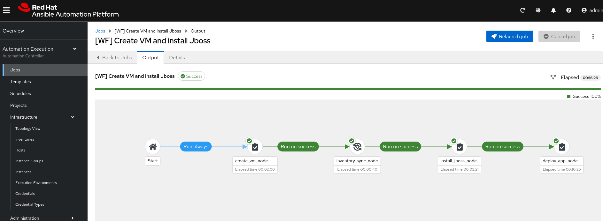

# Ansible and Openshift Virtualization demo

I'd like to use this space to mention that [this Red Hat article](https://www.redhat.com/en/blog/ansible-automation-platform-openshift-virtualization-multi-cluster-environment) was a source of inspiration for this repo. You can find detailed information about what's done in the article by looking at the [author's git repo](https://www.redhat.com/en/blog/ansible-automation-platform-openshift-virtualization-multi-cluster-environment)

## Resources needed to run this demo

You need an OpenShift cluster with OpenShift Virtualization capabilities. If you're a redhatter or a Red Hat partner you can request an OpenShift cluster running in GCP for the purposes of this demo, you can reuqeest it [here](https://catalog.demo.redhat.com/catalog?item=babylon-catalog-prod/gcp-gpte.ocp4-on-gcp.prod&utm_source=webapp&utm_medium=share-link).

## Prepare your cluster

Install OpenShift Gitops operator via Operator Hub. Use the default installation.

Once installed add the application set in this repo (/gitops/applications/demo-application-set.yaml). Click on the "+" sign on the top right of the GUI:


Then select the project openshift-gitops and copy paste the content of the file /gitops/applications/demo-application-set.yaml of this repo in the GUI:


This will install the OpenShift Virtualization and Ansible Automation Platform operators. It will also deploy our instance of Ansible Automation Platform in the namespace aap.

Wait until all CRD's are installed, then go to the aap namespace and search for the my-aap route and the secret my-aap-admin-password. You can obtain both values by running these commands:

```
oc get route my-aap -n aap -o jsonpath='{.spec.host}'
```
```
oc get secret my-aap-admin-password -n aap -o go-template --template="{{.data.password|base64decode}}"
```

In your browser navigate to the url of the my-aap route and login with user admin and the password you extracted from the secret.
On your first login you need to add your subscription, you can upload a manifest or use your Red Hat Network username and password. Add your subscription and accept the EULA:


Now go to Red Hat's Automation Hub and get a token so your Automation Controller can install official Red Hat collections. Login to [Ansible automation hub](https://console.redhat.com/ansible/automation-hub). Navigate to "Automation Hub" -> "Connect to Hub" and click "Load Token" under "Offline Token" to generate a token. Copy down the token, server URL, and SSO URL.

Now, in your Automation Controller, go to Automation Execution > Infrastructure > Credentials > Create Credential.

Fill the new credential with the following values:
 - Name: Red Hat Automation Hub
 - Organization: Default
 - Credential type: Ansible Galaxy/Automation Hub API Token
 - Galaxy Server URL: the Server URL you got from previour step
 - Auth server URL: the SSO URL you got from previour step
 - API Token: the one you got from previour step


Once you have created the credential go to Access Management > Organizations > Default > Edit organization. In the credentials section of the organization add the newly created credential.

 

 Then click next and order the credentials so the "Red Hat Automation Hub" is above "Ansible Galaxy" credentials (this is needed so the organization uses first the manually created credentials).


Create a project in Automation Execution > Projects > Create project with the following values:
 - Name: OCP Virt
 - Organization: Default
 - Source Control Type: Git
 - Source Control URL: https://github.com/pablo-preciado/aap-ocpv.git
 - Update revision on launch: true

 

Remember to sync the project before continuing.

Before configuring your job template you'll need to gather you OpenShift cluster API url and token, and you will also need to retrieve Red Hat Network client id and client secret.

To obtain OpenShift API url and token you can run these commands:
```
oc cluster-info
oc whoami --show-token
```
To obtain the data of your Service Account use a browser to navigate to [Red Hat Cloud Console](https://console.redhat.com/application-services/service-accounts). Click on Create service account and save your Client ID and Client Secret.

Now create the Job Template for configuring the Ansible Automation Controller. Go to Automation Execution > Templates > Create Template > Create Job Template. Fill with the following information:
 - Name: [CasC] Configure controller
 - Inventory: Demo Inventory
 - Project: OCP Virt
 - Playbook: playbooks/controller-configuration.yml
 - Extra variables: copy paste the following code but using the values you just retrieved.
```
my_controller_fqdn: your-aap-url.com
my_controller_user: admin
my_controller_pass: your-aap-password
openshift_api_url: your-ocp-api-url
openshift_api_token: your-ocp-api-token
rhn_username: your-red-hat-cdn-username
rhn_password: your-red-hat-cdn-password
rhn_client_id: your-red-hat-cdn-client-id
rhn_client_secret: your-red-hat-cdn-client-secret
```


Run the job template and your controller will be configured with all the jobs, credentials, inventories and workflows needed for this demo.

## Run the demo

In Ansible Automation Platform go to Automation Execution > Templates and click on "[WF] Create VM and install Jboss", then click on "Launch Template" button in the top right.


This will deploy a virtual machine in the namespace workloads. Then it'll synchronize the inventory so it shows our new virtual machine and will install Jboss EAP 8 and deploy a Hello World application on it.



Once the workflow has finished running, you can get the route that is exposing the Jboss server running on your virtual machine. You can obtain the route by running this command:
```
oc get route rhel9-jboss8-route -n workloads -o jsonpath='{.spec.host}'
```
Use your browser to access the route and demonstrate you can reach Jboss EAP GUI.


Then use your browser and navigate to the same url but with the path /helloworld and demonstrate the Hello World application is running.


Please, note the Hello World application being deployed comes from the [Jboss Quickstarts repo](https://github.com/jboss-developer/jboss-eap-quickstarts?tab=readme-ov-file).

## Execute from AnsibleJob CRD in OpenShift

You can execute the Ansible Automation Platform workflow by using the AnsibleJob CRD in your OpenShift cluster. For that, you need to create a token for your user in Ansible Automation Platform. Go to Access Management > User > admin > Tokens tab > Create token. Give it Write scope:


Copy the value and keep it save as you wont be able to retrieve it again.

Then go to the OpenShift cluster and create the following secret (remember to user your token and AAP url):

```
apiVersion: v1
kind: Secret
metadata:
  name: controller-access
  namespace: aap
  type: Opaque
stringData:
  token: <generated-token>
  host: https://my-controller-host.example.com/
```

Now you can run the Workflow of this demo by creating the following CRD:

```
apiVersion: tower.ansible.com/v1alpha1
kind: AnsibleJob
metadata:
  name: my-jboss-demo-job
  namespace: aap
spec:
  connection_secret: controller-access
  workflow_template_name: '[WF] Create VM and install Jboss'
  extra_vars:
    my_namespace: workloads
    my_instancetype: u1.medium # typically choose between u1.medium or u1.large
    my_label_app_name: jboss8
    my_git_repo: https://github.com/jboss-developer/jboss-eap-quickstarts.git
    my_app_directory: jboss-eap-quickstarts
    my_app_path_to_pomxml: /helloworld/pom.xml
```